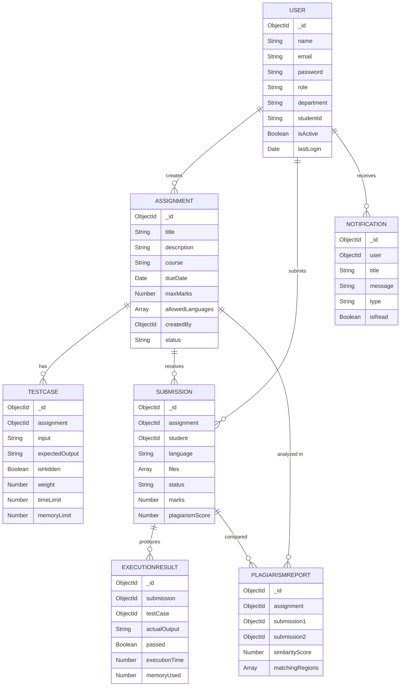

# Automated Student Project Evaluation Hub

A full-stack web application with three roles (Admin, Faculty, Student) supporting assignment management, project submission, Docker-based code execution, custom plagiarism detection (Winnowing fingerprinting), analytics, notifications, PDF reports, and a premium responsive UI.

## User Review Required

> [!IMPORTANT]
> **This is a very large project (~150+ files).** I'll build it incrementally in 10 phases, each verified before moving on. The plan below covers all phases. Please review the architecture and confirm before I begin Phase 1.

> [!WARNING]
> **Docker Desktop** must be installed and running on your machine for the code execution sandbox feature (Phase 7). If Docker is unavailable, I'll implement a simulated execution mode as fallback.

> [!IMPORTANT]
> **MongoDB** must be accessible (local or Atlas). I'll configure the backend to use a `.env` file for the connection string. Please confirm whether you're using a local MongoDB install or MongoDB Atlas.

## Open Questions

1. **Tailwind CSS Version**: You specified Tailwind CSS. Should I use **Tailwind v4** (latest, CSS-first config) or **Tailwind v3** (classic `tailwind.config.js`)? I'll default to **v3** for maximum ecosystem compatibility unless you prefer v4.
2. **MongoDB**: Are you using a local MongoDB install or MongoDB Atlas? I'll create a `.env` template either way.
3. **Supported Languages**: Which programming languages should the Docker sandbox support for code execution? I'll default to **C, C++, Python, Java, JavaScript** — let me know if you need others.
4. **Admin Seed**: Should I create a seed script that auto-creates a default Admin account (`admin@eval.hub / Admin@123`)?

---

## Proposed Architecture

```
d:\Projects\Project Evaluation\
├── client/                    # React + Vite frontend
│   ├── public/
│   ├── src/
│   │   ├── assets/            # Icons, images, fonts
│   │   ├── components/        # Shared UI components (Button, Modal, Sidebar, etc.)
│   │   ├── features/          # Feature-driven modules
│   │   │   ├── auth/          # Login, Register, AuthContext
│   │   │   ├── dashboard/     # Role-based dashboards
│   │   │   ├── assignments/   # CRUD, test cases, assignment views
│   │   │   ├── submissions/   # Upload, status, results
│   │   │   ├── plagiarism/    # Reports, comparison view
│   │   │   ├── analytics/     # Charts, stats
│   │   │   ├── notifications/ # Bell icon, list
│   │   │   ├── reports/       # PDF download, evaluation results
│   │   │   ├── users/         # Admin user management
│   │   │   └── settings/      # Admin settings, audit logs
│   │   ├── hooks/             # Shared hooks (useAuth, useApi, etc.)
│   │   ├── layouts/           # DashboardLayout, AuthLayout
│   │   ├── lib/               # Axios instance, constants
│   │   ├── pages/             # Route-level page components
│   │   ├── styles/            # Global CSS, Tailwind directives
│   │   ├── App.jsx
│   │   └── main.jsx
│   ├── index.html
│   ├── tailwind.config.js
│   ├── postcss.config.js
│   └── vite.config.js
│
├── server/                    # Express.js backend
│   ├── config/
│   │   ├── db.js              # Mongoose connection
│   │   └── env.js             # dotenv loader + validation
│   ├── controllers/
│   │   ├── authController.js
│   │   ├── userController.js
│   │   ├── assignmentController.js
│   │   ├── submissionController.js
│   │   ├── executionController.js
│   │   ├── plagiarismController.js
│   │   ├── notificationController.js
│   │   ├── analyticsController.js
│   │   └── reportController.js
│   ├── middleware/
│   │   ├── auth.js            # JWT verification
│   │   ├── role.js            # Role-based access (admin, faculty, student)
│   │   ├── errorHandler.js    # Global error handler
│   │   ├── validate.js        # Request validation with Joi
│   │   └── upload.js          # Multer config for file uploads
│   ├── models/
│   │   ├── User.js
│   │   ├── Assignment.js
│   │   ├── TestCase.js
│   │   ├── Submission.js
│   │   ├── ExecutionResult.js
│   │   ├── PlagiarismReport.js
│   │   └── Notification.js
│   ├── routes/
│   │   ├── authRoutes.js
│   │   ├── userRoutes.js
│   │   ├── assignmentRoutes.js
│   │   ├── submissionRoutes.js
│   │   ├── executionRoutes.js
│   │   ├── plagiarismRoutes.js
│   │   ├── notificationRoutes.js
│   │   ├── analyticsRoutes.js
│   │   └── reportRoutes.js
│   ├── services/
│   │   ├── executionService.js    # Docker sandbox orchestration
│   │   ├── plagiarismService.js   # Winnowing + Jaccard engine
│   │   ├── evaluationService.js   # Compile → Execute → Score
│   │   ├── reportService.js       # PDF generation with PDFKit
│   │   └── notificationService.js # Create/broadcast notifications
│   ├── utils/
│   │   ├── logger.js
│   │   ├── helpers.js
│   │   └── constants.js
│   ├── docker/
│   │   ├── Dockerfile.sandbox     # Minimal sandbox image
│   │   └── run.sh                 # Entrypoint script
│   ├── uploads/                   # File upload storage
│   ├── .env.example
│   ├── server.js                  # Entry point
│   └── package.json
│
├── .gitignore
└── README.md
```

---

## Proposed Changes

### Phase 1 — Project Initialization & Tooling

Set up both projects with all dependencies, configs, and verify they start cleanly.

---

#### [NEW] Root files

- [README.md](file:///d:/Projects/Project%20Evaluation/README.md) — Project overview, setup instructions
- [.gitignore](file:///d:/Projects/Project%20Evaluation/.gitignore) — Node/React/Docker ignores

---

#### [NEW] client/ — React + Vite + Tailwind

Initialize with `create-vite`, install dependencies:
- **Core**: `react`, `react-dom`, `react-router-dom`
- **HTTP**: `axios`
- **Animation**: `framer-motion`
- **Charts**: `chart.js`, `react-chartjs-2`
- **Styling**: `tailwindcss`, `postcss`, `autoprefixer`
- **Icons**: `react-icons`
- **Toasts**: `react-hot-toast`
- **Date**: `date-fns`

Key config files:
- `vite.config.js` — proxy `/api` to backend port 5000
- `tailwind.config.js` — custom theme (colors, fonts, animations)
- `postcss.config.js`
- `src/styles/index.css` — Tailwind directives + custom design tokens
- `src/main.jsx`, `src/App.jsx` — base setup with BrowserRouter

---

#### [NEW] server/ — Express.js + MongoDB

Initialize with npm, install dependencies:
- **Core**: `express`, `mongoose`, `dotenv`, `cors`
- **Auth**: `jsonwebtoken`, `bcryptjs`
- **Upload**: `multer`, `adm-zip`
- **Validation**: `joi`
- **PDF**: `pdfkit`
- **Logging**: `morgan`
- **Dev**: `nodemon`

Key files:
- `server.js` — Express app entry, middleware chain, route mounting
- `config/db.js` — Mongoose connection with retry
- `config/env.js` — Environment variable validation
- `.env.example` — Template env file

---

### Phase 2 — Authentication System

Full JWT auth with role-based access for Admin, Faculty, Student.

#### [NEW] server/models/User.js
```javascript
{
  name: String,
  email: { type: String, unique: true },
  password: String,            // bcrypt hashed
  role: { type: String, enum: ['admin', 'faculty', 'student'] },
  department: String,
  studentId: String,           // for students
  avatar: String,
  isActive: { type: Boolean, default: true },
  lastLogin: Date,
  createdAt, updatedAt         // timestamps
}
```

#### [NEW] server/controllers/authController.js
- `POST /api/auth/register` — Create user, hash password, return JWT
- `POST /api/auth/login` — Verify credentials, return JWT + user data
- `GET /api/auth/me` — Get current user from token
- `PUT /api/auth/profile` — Update profile

#### [NEW] server/middleware/auth.js
- Extract Bearer token, verify JWT, attach `req.user`

#### [NEW] server/middleware/role.js
- `authorize('admin', 'faculty')` — Role gate middleware

#### [NEW] client/features/auth/
- `AuthContext.jsx` — React context for auth state, token storage
- `LoginPage.jsx` — Premium login form with glassmorphism effect
- `RegisterPage.jsx` — Registration form with role selection
- `ProtectedRoute.jsx` — Route wrapper checking auth + role

#### [NEW] client/hooks/useAuth.js
- Hook to access auth context

#### [NEW] client/lib/axios.js
- Preconfigured Axios instance with auth interceptors

---

### Phase 3 — Database Schema (All Models)

#### [NEW] server/models/Assignment.js
```javascript
{
  title: String,
  description: String,
  course: String,
  department: String,
  dueDate: Date,
  maxMarks: Number,
  allowedLanguages: [String],  // ['c', 'cpp', 'python', 'java', 'javascript']
  createdBy: ObjectId → User,
  attachments: [String],       // file paths
  isPublished: Boolean,
  status: { type: String, enum: ['draft', 'active', 'closed'] }
}
```

#### [NEW] server/models/TestCase.js
```javascript
{
  assignment: ObjectId → Assignment,
  input: String,
  expectedOutput: String,
  isHidden: Boolean,           // hidden from students
  weight: Number,              // marks weight
  timeLimit: Number,           // ms
  memoryLimit: Number          // MB
}
```

#### [NEW] server/models/Submission.js
```javascript
{
  assignment: ObjectId → Assignment,
  student: ObjectId → User,
  language: String,
  files: [{ name: String, path: String, content: String }],
  githubUrl: String,
  submittedAt: Date,
  status: { type: String, enum: ['pending', 'executing', 'evaluated', 'error'] },
  marks: Number,
  feedback: String,
  plagiarismScore: Number
}
```

#### [NEW] server/models/ExecutionResult.js
```javascript
{
  submission: ObjectId → Submission,
  testCase: ObjectId → TestCase,
  actualOutput: String,
  passed: Boolean,
  executionTime: Number,       // ms
  memoryUsed: Number,          // MB
  error: String,
  exitCode: Number
}
```

#### [NEW] server/models/PlagiarismReport.js
```javascript
{
  assignment: ObjectId → Assignment,
  submission1: ObjectId → Submission,
  submission2: ObjectId → Submission,
  similarityScore: Number,     // 0-100 percentage
  matchingRegions: [{
    file1: { start: Number, end: Number, content: String },
    file2: { start: Number, end: Number, content: String }
  }],
  fingerprints1: [Number],
  fingerprints2: [Number],
  commonFingerprints: [Number],
  status: { type: String, enum: ['pending', 'completed', 'error'] }
}
```

#### [NEW] server/models/Notification.js
```javascript
{
  user: ObjectId → User,
  title: String,
  message: String,
  type: { type: String, enum: ['assignment', 'submission', 'result', 'plagiarism', 'system'] },
  isRead: Boolean,
  link: String,
  createdAt: Date
}
```

---

### Phase 4 — Dashboards & Layouts

Premium, role-specific dashboards with stats cards, charts, and quick actions.

#### [NEW] client/layouts/
- `DashboardLayout.jsx` — Collapsible sidebar + topbar + main content area
- `AuthLayout.jsx` — Centered auth forms with animated background

#### [NEW] client/components/ (Shared UI Kit)
- `Sidebar.jsx` — Animated sidebar with role-based navigation
- `Topbar.jsx` — Search, notifications bell, profile dropdown
- `StatsCard.jsx` — Gradient stat card with icon and trend indicator
- `DataTable.jsx` — Sortable, filterable, paginated table
- `Modal.jsx` — Animated modal overlay
- `Button.jsx` — Variant buttons (primary, secondary, danger, ghost)
- `Badge.jsx` — Status badges with colors
- `LoadingSpinner.jsx` — Animated loading indicator
- `EmptyState.jsx` — Empty state illustration with CTA

#### [NEW] client/features/dashboard/
- `StudentDashboard.jsx` — Upcoming assignments, recent submissions, stats
- `FacultyDashboard.jsx` — Active assignments, pending reviews, class performance
- `AdminDashboard.jsx` — System stats, user counts, activity feed

#### [NEW] client/pages/DashboardPage.jsx
- Route: `/dashboard` — Renders role-specific dashboard

---

### Phase 5 — Assignment Management

Full CRUD for assignments and test cases (Faculty creates, Students view).

#### [NEW] server/controllers/assignmentController.js
- `GET /api/assignments` — List (filtered by role)
- `GET /api/assignments/:id` — Single assignment with test cases
- `POST /api/assignments` — Create (faculty only)
- `PUT /api/assignments/:id` — Update
- `DELETE /api/assignments/:id` — Delete
- `POST /api/assignments/:id/test-cases` — Add test case
- `PUT /api/assignments/:id/test-cases/:tcId` — Update test case
- `DELETE /api/assignments/:id/test-cases/:tcId` — Remove test case

#### [NEW] client/features/assignments/
- `AssignmentList.jsx` — Card grid with filters
- `AssignmentDetail.jsx` — Full details, test cases, submission status
- `AssignmentForm.jsx` — Create/edit form with rich editor
- `TestCaseManager.jsx` — Add/edit/remove test cases

---

### Phase 6 — Project Upload (ZIP / GitHub URL)

#### [NEW] server/middleware/upload.js
- Multer config for ZIP uploads (max 50MB)
- ZIP extraction using `adm-zip`

#### [NEW] server/controllers/submissionController.js
- `POST /api/submissions` — Upload ZIP or provide GitHub URL
- `GET /api/submissions` — List (students see own, faculty see all for their assignments)
- `GET /api/submissions/:id` — Single submission with results

#### [NEW] client/features/submissions/
- `SubmissionUpload.jsx` — Drag-and-drop zone + GitHub URL input
- `SubmissionList.jsx` — Filterable submissions table
- `SubmissionDetail.jsx` — Code viewer with execution results

---

### Phase 7 — Docker-Based Code Execution Sandbox

#### [NEW] server/docker/Dockerfile.sandbox
```dockerfile
FROM ubuntu:22.04
RUN apt-get update && apt-get install -y gcc g++ python3 openjdk-17-jdk nodejs
RUN useradd -m sandbox
USER sandbox
WORKDIR /code
```

#### [NEW] server/docker/run.sh
- Entrypoint that compiles and runs code, captures stdout/stderr

#### [NEW] server/services/executionService.js
- Spin up ephemeral Docker container per submission
- Mount code as read-only volume
- Apply resource limits: `--memory=128m --cpus=0.5 --pids-limit=50 --network none`
- Enforce timeout (10s default)
- Capture output, execution time, memory usage
- Destroy container after execution
- Compare output with expected output from test cases

#### [NEW] server/controllers/executionController.js
- `POST /api/execute/:submissionId` — Trigger execution
- `GET /api/execute/:submissionId/results` — Get results

---

### Phase 8 — Custom Plagiarism Detection Engine

Implements the full Winnowing fingerprinting pipeline without any external service.

#### [NEW] server/services/plagiarismService.js

**Pipeline:**
1. **Normalize** — Strip comments (`//`, `/* */`, `#`), remove whitespace, lowercase
2. **Tokenize** — Extract meaningful tokens (identifiers, keywords, operators)
3. **K-Gram Generation** — Sliding window of k=5 tokens
4. **Hash** — Rolling hash each k-gram
5. **Winnowing** — Select minimum hash in each window of size w=4
6. **Compare** — Jaccard similarity: `|A ∩ B| / |A ∪ B| × 100`
7. **Highlight** — Map common fingerprints back to source regions

#### [NEW] server/controllers/plagiarismController.js
- `POST /api/plagiarism/check/:assignmentId` — Run pairwise comparison on all submissions
- `GET /api/plagiarism/report/:reportId` — Get detailed report
- `GET /api/plagiarism/assignment/:assignmentId` — Summary matrix

#### [NEW] client/features/plagiarism/
- `PlagiarismMatrix.jsx` — Heatmap of pairwise similarity
- `PlagiarismReport.jsx` — Side-by-side code comparison with highlighted matches
- `PlagiarismSummary.jsx` — Per-assignment summary with flagged pairs

---

### Phase 9 — Automatic Evaluation Engine

#### [NEW] server/services/evaluationService.js

**Pipeline:**
1. Extract submission files
2. For each test case:
   - Compile code (if compiled language)
   - Execute with test input
   - Compare output with expected output
   - Record execution time and memory
3. Calculate test case score (pass/fail × weight)
4. Run plagiarism check
5. Compute final marks: `testScore × (1 - plagiarismPenalty)`
6. Generate evaluation report
7. Create notification for student

---

### Phase 10 — Analytics, Notifications, PDF Reports, Polish

#### Analytics
- [NEW] server/controllers/analyticsController.js
  - `GET /api/analytics/overview` — System-wide stats
  - `GET /api/analytics/assignment/:id` — Per-assignment stats
  - `GET /api/analytics/student/:id` — Student performance
- [NEW] client/features/analytics/
  - `AnalyticsDashboard.jsx` — Chart.js bar/line/pie/doughnut charts
  - `PerformanceChart.jsx` — Student performance over time
  - `SubmissionStats.jsx` — Submission distribution, pass rates

#### Notifications
- [NEW] server/services/notificationService.js — Create and broadcast notifications
- [NEW] server/controllers/notificationController.js
  - `GET /api/notifications` — User's notifications
  - `PUT /api/notifications/:id/read` — Mark as read
  - `PUT /api/notifications/read-all` — Mark all read
- [NEW] client/features/notifications/
  - `NotificationBell.jsx` — Topbar bell with unread count badge
  - `NotificationList.jsx` — Dropdown list of notifications

#### PDF Reports
- [NEW] server/services/reportService.js — PDFKit-based report generation
  - Student evaluation report
  - Plagiarism comparison report
  - Assignment summary report
- [NEW] server/controllers/reportController.js
  - `GET /api/reports/submission/:id` — Download evaluation PDF
  - `GET /api/reports/plagiarism/:id` — Download plagiarism PDF
  - `GET /api/reports/assignment/:id` — Download assignment summary PDF

#### Admin Features
- [NEW] client/features/users/ — User management (CRUD, activate/deactivate)
- [NEW] client/features/settings/ — Audit logs, system settings

---

## Database Schema Diagram



---

## API Routes Summary

| Method | Endpoint | Auth | Roles | Description |
|--------|----------|------|-------|-------------|
| POST | `/api/auth/register` | No | — | Register new user |
| POST | `/api/auth/login` | No | — | Login, get JWT |
| GET | `/api/auth/me` | Yes | All | Get current user |
| PUT | `/api/auth/profile` | Yes | All | Update profile |
| GET | `/api/users` | Yes | Admin | List all users |
| PUT | `/api/users/:id` | Yes | Admin | Update user |
| DELETE | `/api/users/:id` | Yes | Admin | Deactivate user |
| GET | `/api/assignments` | Yes | All | List assignments |
| POST | `/api/assignments` | Yes | Faculty | Create assignment |
| PUT | `/api/assignments/:id` | Yes | Faculty | Update assignment |
| DELETE | `/api/assignments/:id` | Yes | Faculty | Delete assignment |
| POST | `/api/assignments/:id/test-cases` | Yes | Faculty | Add test case |
| POST | `/api/submissions` | Yes | Student | Submit project |
| GET | `/api/submissions` | Yes | All | List submissions |
| POST | `/api/execute/:submissionId` | Yes | Faculty | Run code |
| GET | `/api/execute/:submissionId/results` | Yes | All | Get results |
| POST | `/api/plagiarism/check/:assignmentId` | Yes | Faculty | Run plagiarism check |
| GET | `/api/plagiarism/report/:id` | Yes | Faculty | View report |
| GET | `/api/notifications` | Yes | All | Get notifications |
| PUT | `/api/notifications/:id/read` | Yes | All | Mark read |
| GET | `/api/analytics/overview` | Yes | Admin/Faculty | System stats |
| GET | `/api/reports/submission/:id` | Yes | All | Download eval PDF |
| GET | `/api/reports/plagiarism/:id` | Yes | Faculty | Download plag PDF |

---

## UI Design System

### Color Palette (Dark-First)
| Token | Light | Dark |
|-------|-------|------|
| Background | `#f8fafc` | `#0f172a` |
| Surface | `#ffffff` | `#1e293b` |
| Surface Elevated | `#f1f5f9` | `#334155` |
| Primary | `#6366f1` (Indigo) | `#818cf8` |
| Secondary | `#06b6d4` (Cyan) | `#22d3ee` |
| Accent | `#f59e0b` (Amber) | `#fbbf24` |
| Success | `#10b981` | `#34d399` |
| Danger | `#ef4444` | `#f87171` |
| Text Primary | `#0f172a` | `#f1f5f9` |
| Text Secondary | `#64748b` | `#94a3b8` |

### Typography
- **Font**: Inter (Google Fonts) — clean, professional
- **Scale**: 12/14/16/18/20/24/30/36/48px

### Effects
- Glassmorphism cards on auth pages
- Gradient accent bars on dashboard cards
- Framer Motion page transitions, hover animations, list stagger
- Dark mode toggle in topbar

---

## Verification Plan

### Automated Tests
Each phase will be verified before proceeding:

```bash
# Phase 1: Both apps start without errors
cd client && npm run dev    # → http://localhost:5173
cd server && npm run dev    # → http://localhost:5000

# Phase 2: Auth endpoints work
curl -X POST http://localhost:5000/api/auth/register -H "Content-Type: application/json" -d '{"name":"Test","email":"test@test.com","password":"Test@123","role":"student"}'
curl -X POST http://localhost:5000/api/auth/login -H "Content-Type: application/json" -d '{"email":"test@test.com","password":"Test@123"}'

# Phase 7: Docker sandbox runs
docker build -t eval-sandbox server/docker/
docker run --rm --memory=128m --cpus=0.5 eval-sandbox echo "hello"

# Phase 8: Plagiarism engine unit test
node server/services/plagiarismService.test.js
```

### Manual Verification
- Login/register flow works in browser for all three roles
- Dashboard shows correct data per role
- Assignment CRUD works from Faculty view
- File upload and ZIP extraction works
- Code execution returns correct output
- Plagiarism engine flags similar code correctly
- PDF reports download and render properly
- Notifications appear in real-time
- Responsive on mobile viewports
- Dark/light mode toggle functions

---

## Execution Order

| Phase | Deliverable | Est. Files |
|-------|-------------|------------|
| 1 | Project init, both apps running | ~15 |
| 2 | Full auth system (backend + frontend) | ~20 |
| 3 | All Mongoose models | ~7 |
| 4 | Layouts, UI kit, dashboards | ~20 |
| 5 | Assignment management (CRUD + test cases) | ~15 |
| 6 | Project upload (ZIP + GitHub) | ~10 |
| 7 | Docker execution sandbox | ~8 |
| 8 | Plagiarism engine | ~10 |
| 9 | Auto-evaluation pipeline | ~5 |
| 10 | Analytics, notifications, PDF, polish | ~25 |
| **Total** | | **~135 files** |

I will build each phase completely, verify it works, and then proceed to the next. If any phase requires changes to prior work, I'll update accordingly.
